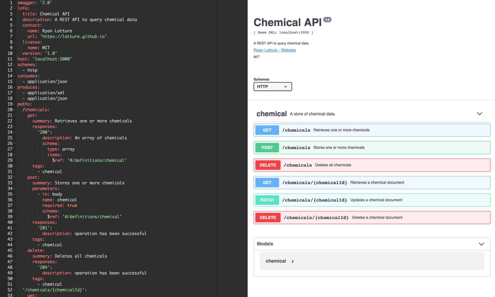

Chemical API
============
This project implements a REST API to query a database of chemical data.
The API is written in Python and is built using [Eve](http://python-eve.org/) (a REST API framework based on [Flask](http://flask.pocoo.org/) and [MongoDB](https://www.mongodb.com/)).
Files are served using [NGINX](https://www.nginx.com/), and the WSGI is provided by [uWSGI](https://uwsgi-docs.readthedocs.io/).
The API provides public `GET` access. 
All other methods require valid authorization.
`POST`s to the database are verified using [Cerberus](http://docs.python-cerberus.org/).
A demo of the application is hosted on [AWS](http://ec2-13-57-9-7.us-west-1.compute.amazonaws.com:5000/chemicals).

Each entry in the chemical database holds information of the chemical formula, band gap and color if the form of key, value pairs, i.e.:

```JSON
{
    "formula": "Cd1I2",
    "band_gap": 3.19,
    "color": "White"
}
```

MongoDB-style queries are supported.
To search for chemicals where `band_gap < 3`, simply add the appropriate query parameters:

```txt
http://localhost:5000/chemicals?where={"band_gap":{"$lt":3.0}}
```

Python syntax also works:
```txt
http://localhost:5000/chemicals?where="band_gap"<3
```

More complex queries are also possible.
To find all compounds where `0 < band_gap < 3`:

```txt
http://localhost:5000/chemicals?where={"$and":[{"band_gap":{"$gt":0.0}},{"band_gap":{"$lt":3.0}}]}
```

To find all compounds that contain gallium:

```txt
http://localhost:5000/chemicals?where={"formula":{"$regex":"Ga"}}
```

Or to find all compounds that contain gallium and that have a band gap between 0 and 3:

```txt
http://localhost:5000/chemicals?where={"$and":[{"formula":{"$regex":"Ga"}},{"band_gap":{"$gt":0.0}},{"band_gap":{"$lt":3.0}}]}
```

A sample client that implements these examples and also shows how to `POST` new chemicals to the database is provided in the `client` folder of this repository. 
To run those examples install the requirements (`pip install -r client/requirements.txt`), start the server (see the next section) and run the script (`python client/client.py`).
Note, the client requires Python 3.6, so make sure you're running the latest version. 


Building and Configuration
--------------------------
A `docker-compose.yml` file is provided to easily run the application.
Before running make sure [Docker](https://www.docker.com/) is installed on your machine.
To start the application, first clone the repository (`git clone https://github.com/latture/chemical_api.git`).
Then define the port we want the application to listen on as well as the admin username and password.

This is done using a `.env` file.
Navigate to the root directory (where the README file is located) and create the file:

```sh
>>> cd /path/to/chemical_api
>>> touch .env
```

Next, add the following items to the `.env` file:

```txt
LISTEN_PORT=5000
ADMIN_USERNAME=<admin_name>
ADMIN_PASSWORD=<admin_password>
```

If no username and password are provided (not recommended), the API defaults to `ADMIN_USERNAME=admin` and `ADMIN_PASSWORD=admin`. 
Don't use the defaults.
Once the `.env` file is created, we're ready to run the application.
From the root directory, execute

```sh
>>> docker-compose up
```

This will pull down the base images and host the application on `http://localhost:LISTEN_PORT`.
Access the the chemical data base at `http://localhost:LISTEN_PORT/chemicals`.


Documentation
-------------
The API is documented using [Swagger](https://swagger.io) at the endpoint `/api-docs`.
The response from that endpoint can be used with [Swagger UI](https://swagger.io/swagger-ui/) to generate documentation for the full API. (See image below.)




Seeding the database
--------------------
The seed data was provided in CSV format.
However, the CSV was converted to JSON to make the data a little easier to work with.
The script used to convert the data can be found at `reformat-data/convert_csv_data_to_json.py`.
Before running this script, install the dependencies via `pip install -r reformat-data/requirements.txt`.
For convenience, the JSON output is provided in this repo (`mongo-seed/data.json`).


Unit Tests
----------
Unit tests are provided in the `tests` directory.
To run them, install the development requirements on your machine `pip install -r dev-requirements.txt`.
You'll also need a running instance of MongoDB.
To start the database, install [MongoDB](https://docs.mongodb.com/manual/installation) then run `mongod` from the terminal.
Finally, navigate to this repo's root directory and execute:

```sh
>>> python -m unittest tests.test_app
```
